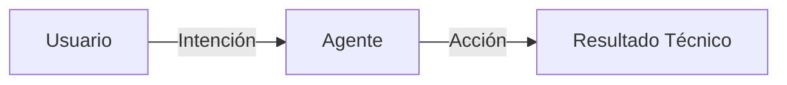
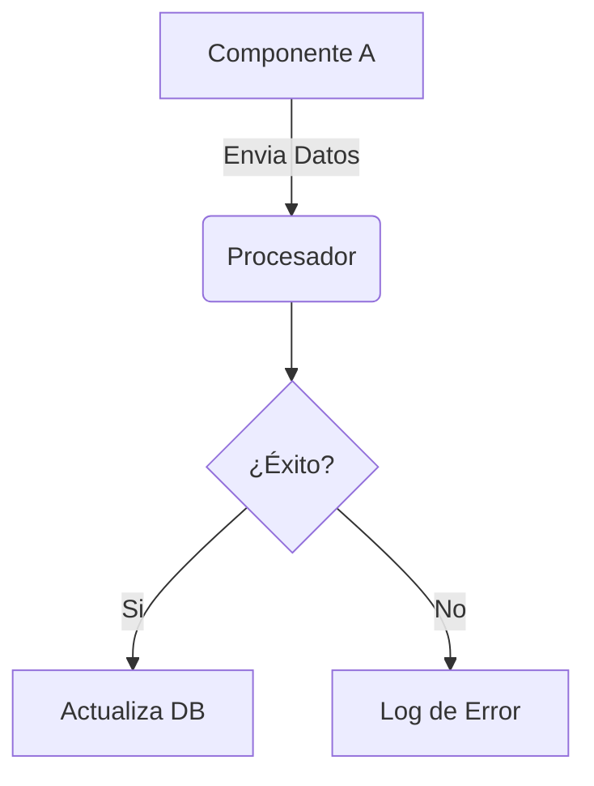

import { Tabs, TabItem } from '@astrojs/starlight/components';

# 🏗️ [NOMBRE_DEL_PROYECTO]

> **ID de Historia SCRUM:** [ID_HISTORIA]
> **Última Actualización:** [FECHA] por [AGENT_ID]

## 🎯 Intenciones del Usuario
*¿Qué quería lograr el usuario con este cambio/funcionalidad?*

- **Prompt Original:** "[Citar el prompt del usuario aquí]"
- **Objetivo Final:** [Explicación clara del resultado esperado]

## 🧠 El "Porqué" (Pensamiento Lateral)
*Justificación de las decisiones arquitectónicas tomadas por el agente.*

- **Decisión:** [Ej: Usar un JSON centralizado en lugar de múltiples archivos]
- **Razón:** [Ej: Facilita la consistencia y reduce la latencia de búsqueda para otros agentes]
- **Alternativas descartadas:** [Ej: No se usó SQL para evitar overhead en esta fase]

## 🛠️ Skeleton Técnico
*Mapeo de archivos modificados y lógica implementada.*

### Arquitectura de Conexión

### Archivos Clave:
- `[ruta/al/archivo]`: [Descripción de su función]
- `[ruta/al/archivo]`: [Descripción de su función]

## 📜 Historial de Cambios (Changelog)
*Rastreo cronológico de la evolución de esta pieza de software.*

| Fecha | Agente | Acción | Resultado |
| :--- | :--- | :--- | :--- |
| [FECHA] | [ID] | Creación Inicial | Skeleton base |

---

## 🔗 Nexo con SCRUM
<aside>
  <strong>Estado Actual:</strong> [Live Status Component Placeholder]
   
  <a href="http://localhost:5173/story/[ID_HISTORIA]">Ver Historia en Scrum Master v2</a>
</aside>
